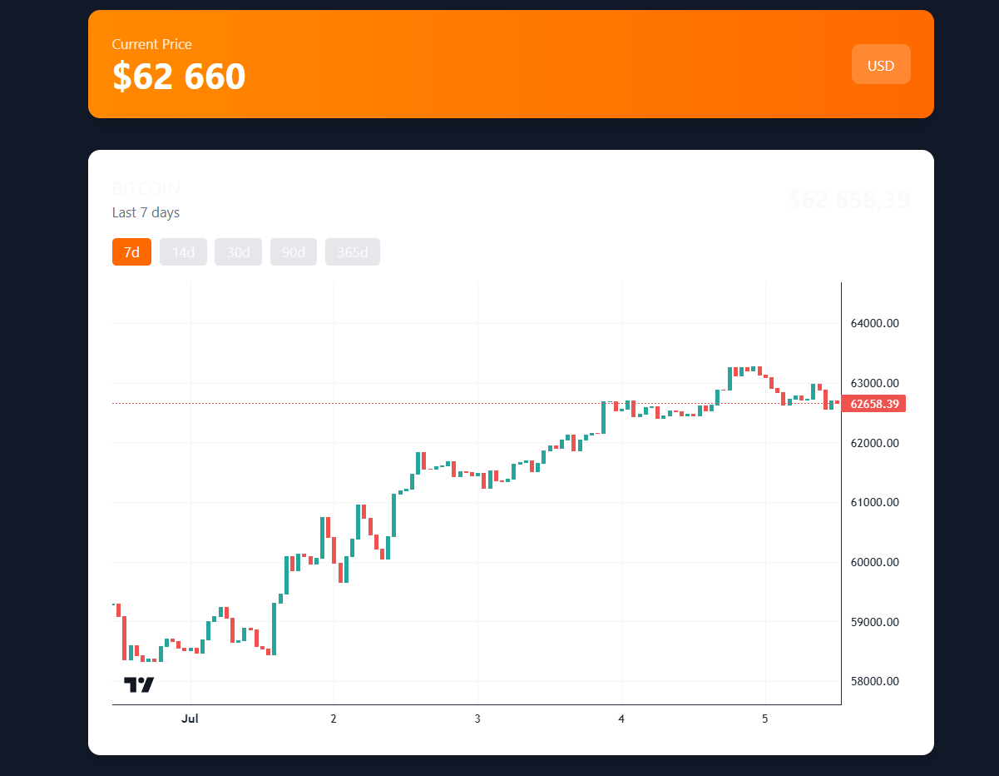

# 📊 Trading Terminal

> Современный веб-терминал для отслеживания криптовалютных цен в реальном времени

## 

## 📋 О проекте

**Trading Terminal** — это веб-приложение для мониторинга криптовалютных рынков. На данный момент реализована базовая функциональность: отображение текущей цены Bitcoin с интеграцией через CoinGecko API.

---

## 🛠 Стек технологий

| Слой                 | Технологии                                    |
| -------------------- | --------------------------------------------- |
| **Frontend**         | React, TypeScript, Tailwind CSS, React Router |
| **Backend**          | Node.js, Express, Axios                       |
| **State Management** | React Query                                   |
| **Build Tool**       | Vite, Bun                                     |
| **API**              | CoinGecko API                                 |
| **Code Quality**     | ESLint, TypeScript                            |

---

### 🔥 Ближайшие цели

- [x] **График** — визуализация исторических данных с Recharts
- [x] **Несколько валют** — BTC, ETH, SOL, ADA
- [ ] **WebSocket** — обновление цен в реальном времени
- [ ] **Страница 404**

### ⚡ В процессе

- [x] **Docker** — контейнеризация frontend + backend
- [ ] **Zustand** — управление состоянием валют
- [ ] **Shadcn UI** — улучшение UI/UX

### 📦 В планах

- [ ] **Тестирование** — Vitest + React Testing Library
- [ ] **База данных** — сохранение истории (SQLite/PostgreSQL)
- [ ] **Аутентификация** — пользовательские аккаунты
- [ ] **CI/CD** — автоматический деплой на Vercel/Railway

### 🚀 Дальнейшее развитие

- [ ] **Next.js** — миграция для SEO и SSR (опционально)
- [ ] **Мобильное приложение** — React Native (если будет интересно)
- [ ] **Торговые сигналы** — AI-аналитика на основе данных

---
