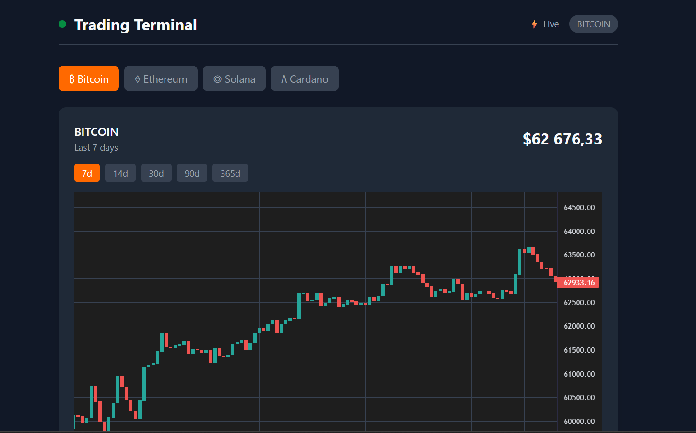

# 📊 Trading Terminal

> Современный веб-терминал для отслеживания криптовалютных цен в реальном времени

## 📋 О проекте

**Trading Terminal** — это full-stack веб-приложение для мониторинга криптовалютных рынков. Включает графики цен, книгу ордеров и поддержку множества валют с обновлением данных в реальном времени через WebSocket.

---

## 🛠 Стек технологий

| Слой                 | Технологии                                    |
| -------------------- | --------------------------------------------- |
| **Frontend**         | React 18, TypeScript, Tailwind CSS, Shadcn UI |
| **Backend**          | Bun, Express 5, WebSocket (ws), Zod, Axios    |
| **API**              | CoinGecko API, Binance WebSocket              |
| **State Management** | Zustand, TanStack Query (React Query)         |
| **Charts**           | Lightweight Charts (TradingView)              |
| **Build Tool**       | Vite                                          |
| **Testing**          | Vitest, React Testing Library                 |
| **Code Quality**     | ESLint, TypeScript, Prettier                  |
| **Containerization** | Docker, Docker Compose                        |

---

### ⚡ В процессе

- [ ] **Lightweight Charts** — добавление функций управления графиком
- [ ] **CI/CD** — автоматический деплой на Railway/Render

### 📦 В планах

- [ ] **База данных** — сохранение истории (PostgreSQL)
- [ ] **Аутентификация** — пользовательские аккаунты
- [ ] **E2E тесты** — Playwright

### 🚀 Дальнейшее развитие

- [ ] **Next.js** — миграция для SEO и SSR (опционально)
- [ ] **Мобильное приложение** — React Native
- [ ] **Торговые сигналы** — AI-аналитика на основе данных

---
